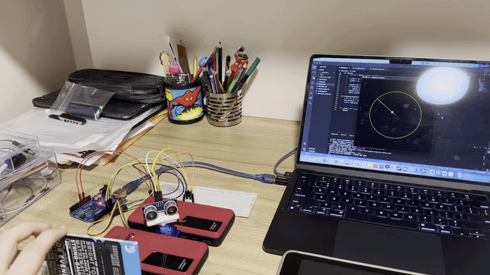
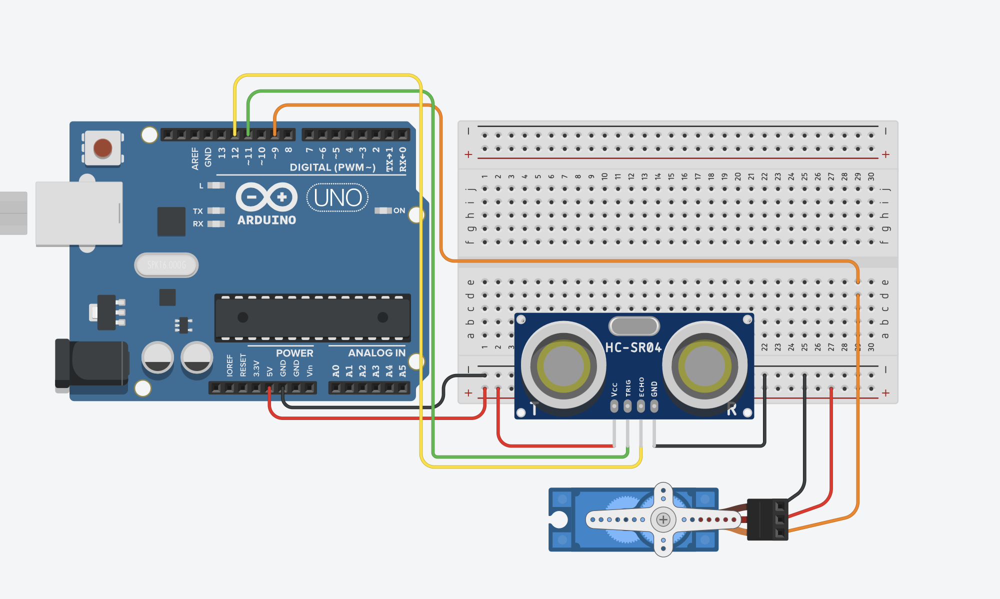

# Arduino Ultrasonic Radar (HC-SR04 + SG90)

A real-time object detection and distance mapping system built using an HC-SR04 ultrasonic sensor and an SG90 servo motor.

---
## Demo

---

## Circuit

---

### Components
- Arduino Uno
- HC-SR04 Ultrasonic Sensor
- SG90 Mini Servo
- Breadboard + Jumper Wires

## How It Works

The system is built on a non-blocking timing architecture using millis(). This ensures the servo movement and distance measurements happen concurrently without stuttering.

* Scanning: The servo motor sweeps back and forth between 20° and 160° in 5-degree increments.

* Measurement: At each step, the HC-SR04 sends a sonic burst and listens for the return using pulseIn.

---

## What I Learned

* Non-blocking Programming: Managing multiple hardware components simultaneously using millis() instead of delay().
  
* Data Formatting: Organizing Serial output into CSV-like strings for external visualization tools.
  
* Hardware Troubleshooting: Managing power draw for motors and ensuring common ground across components.

---

## Skills
`Arduino` `C++` `Embedded Systems` `Robotics` `Real-time Data Processing` `Sensors` `Pulse Width Modulation (PWM)`

